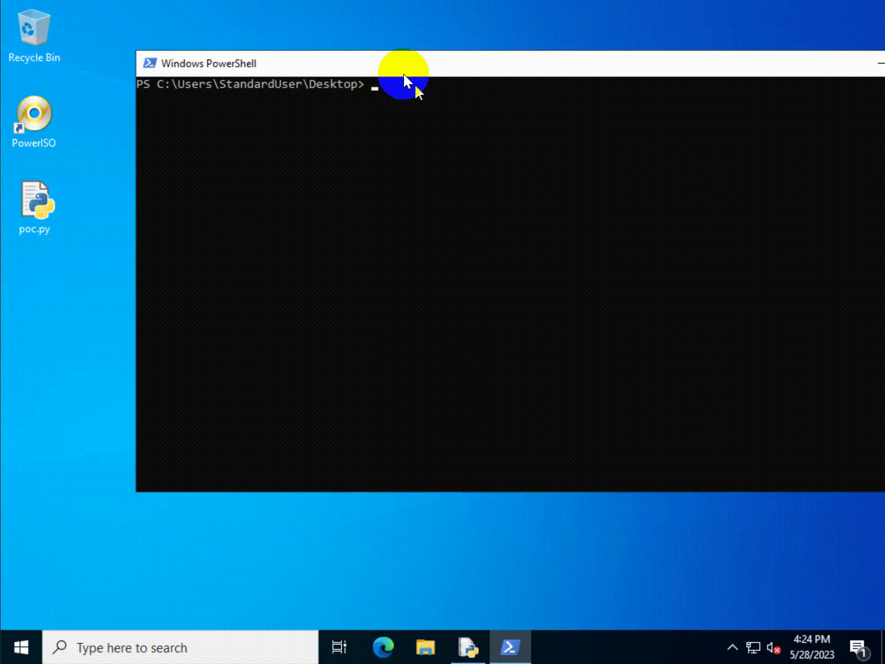

# scdemu.sys - Local Privilege Elevation Vulnerability

## 1. What is scdemu.sys

scdemu.sys is a Virtual Drive driver used by [PowerISO](https://www.poweriso.com/download.htm) to mount .iso, .mdf, etc. image files on Windows. The driver is automatically installed in `%windir%\system32\drivers\` when user finished PowerISO's installer. It is loaded when system starts up and persists until system shuts down:

```console
$ sc qc scdemu
[SC] QueryServiceConfig SUCCESS

SERVICE_NAME: scdemu
        TYPE               : 1  KERNEL_DRIVER
        START_TYPE         : 1   SYSTEM_START   <-- NOTICE HERE!
        ERROR_CONTROL      : 1   NORMAL
        BINARY_PATH_NAME   :
        LOAD_ORDER_GROUP   :
        TAG                : 0
        DISPLAY_NAME       : SCDEmu
        DEPENDENCIES       :
        SERVICE_START_NAME :
```

The version of the vulnerable scdemu.sys is 6.9.0.0, which is digital signed by ___Power Software Limited___ on June 7, 2017. According to PowerISO's [version history](https://poweriso.com/tutorials/history.htm), affected PowerISO versions should be 6.9 through 8.6. I reported the vulnerability to PowerISO developers on last days of May, 2023, when PowerISO had version 8.5. However, I haven't received any further messages about the fix progress even on today, Oct 6, 2023. And the PowerISO 8.6 version, released on Sep 12, 2023, still contains the vulnerable scdemu.sys.

## 2. What is the vulnerability caused by?

In IRP_MJ_DEVICE_CONTROL handle routine, when IOCTL code is 0x80002018, the driver doesn't validate the ioctl caller's privilege and directly pass caller-supplied data to `RtlWriteRegistryValue`, which causes an arbitrary registry write. (See function `sub_12130` in IDA.) A non-admin process can write data to admin-protected registry value, such as the value `Debugger` under `HKLM\Software\Microsoft\Windows NT\CurrentVersion\Image File Execution Options\wsqmcons.exe`, so that it can launch any exe with `nt authority\system` privilege.

## 3. PoC

See `poc.py`. Please ensure you have Python3 and you have `pywin32` package installed.

To exploit, just run it.

## 4. Demonstration


